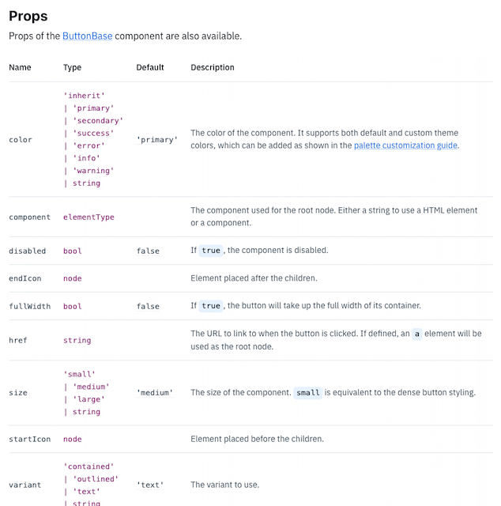

[아토믹 디자인](https://bradfrost.com/blog/post/atomic-web-design/) 이란 원자(atom)-분자(molecule)-유기체(organism) 순으로
최소 단위의 atom 컴포넌트를 조합하여 단계별로 나타내는 설계 기준이 있다.

최근 팀 내 프로젝트에서 이런 패턴으로 컴포넌트를 단계별로 구현하는 경험을 하였는데, 어려웠던 점은 최소단위인 atom 컴포넌트를 구현하는 방법이었다.
최소단위의 컴포넌트는 HTML 엘리먼트와 닮아있다. 가령 버튼 atom 컴포넌트를 만든다고 가정해보자.

이 버튼은 특정 자바스크립트 이벤트를 트리거 하기 위한 버튼일 수도 있고, 양식을 제출하기 위한 버튼일 수도 있다. 특정 페이지로 이동시키는 링크를 제공하는 버튼일수도 있다.\
최소단위를 이루는 컴포넌트는 위와 같이 넒은 범위의 쓰임새에 대한 많은 가정을 해야하며 그 때문에 구현하기 까다로워 보인다.

특정 문제를 해결하는 도메인에 집중하는 서비스 개발과는 달리 라이브러리를 만들듯이 **범용성**을 갖추어야 한다.
React UI 라이브러리인 [머티리얼 UI](https://mui.com/)의 Button 컴포넌트의 API 를 살펴보자. clickable 한 요소가 수용할 수 있는 넒은 범위의 수많은 옵션(Prop)을 제공한다. 



'어떻게 보여질 것인가' 를 정의하는 옵션이외에 대략 다음과 같은 옵션을 확인할 수 있다.

* component(as) : 어떤 ElementNode 로 렌더링할 것인가
* disabled : 클릭 이벤트를 비활성화
* href : 링크 기능으로 쓰일때에 이동 주소

문서내에 언급되진 않았지만 이 외 onClick, type 등 다양한 기본 옵션들이 존재한다. 이제 여러 사용케이스를 포괄하는 다형성을 지닌 버튼을 만들어보자.

## Button 을 만들어보자.

'어떻게 보여질 것인가' 를 제외한 몇가지 옵션이 구현된 버튼을 만들어보자. 어떻게 보여질것인가를 다루지 않기때문에 완성된 형태는 `<button>` ReactElement 와 동일할 것이다.

```tsx
import React from 'react';

interface ButtonProps {
  children: React.ReactNode;
  onClick?: React.MouseEventHandler<HTMLButtonElement>;
}

export default function Button({onClick, children}: ButtonProps) {
  return (
  <button type="button" onClick={onClick}>
  {children}
  </button>
  );
}   
```

현재 상태로는 클릭 이벤트를 바인딩 할 수 있지만 type, disabled 등 `<button>` 이 지니는 기본 어트리뷰트를 제어할 수 없다.

`ComponentPropsWithoutRef`([참고](https://react-typescript-cheatsheet.netlify.app/docs/advanced/patterns_by_usecase#wrappingmirroring-a-html-element)) 를 이용하여 조금 더 범용적으로 타입을 정의해보자.

```tsx
interface ButtonProps extends React.ComponentPropsWithoutRef<'button'> {
  children: React.ReactNode;
}

export default function Button({children, ...rest}: ButtonProps) {
  return <button {...rest}>{children}</button>;
}
```

이제 Button atom 요소를 다양한 사용 케이스를 포괄하여 사용할 수 있게 되었다.

## 다형적 컴포넌트

머티리얼 UI 에서 제공하는 버튼 컴포넌트를 살펴보면 `<button>` 처럼 사용할 수도 있지만 href, target 등 어트리뷰트를 넘길 수 있는 `<a>` 로 사용할 수도 있다.

`href` 가 있느냐 없느냐를 기준으로 어떤 엘리먼트로 렌더링할지 분기해보자.

```tsx
type ButtonElementProps = JSX.IntrinsicElements['button'];
type AnchorElementProps = JSX.IntrinsicElements['a'];
type ButtonProps = ButtonElementProps | AnchorElementProps;

function isPropsForAnchorElement(
  props: ButtonProps
): props is AnchorElementProps {
  return 'href' in props;
}

export default function Button(props: ButtonProps) {
  if (isPropsForAnchorElement(props)) {
  return <a {...props} />;
  } else {
  return <button {...props} />;
  }
}
```

이제 Button 컴포넌트는 아래와 같은 두가지 사용 사례를 받아들 일 수 있게 되었다.

```tsx
<Button type="button" onClick={() => alert('clicked!')}>
  클릭이벤트
</Button>
<Button href="https://google.com" target="_blank">
  google 로 이동
</Button>
```

조금 더 욕심을 부려 ReactRouter 를 사용할때에 `<NavLink />` 등 다른 컴포넌트를 Button 컴포넌트를 통해 렌더링 할 수 있을까? NavLink 는 자주 쓰이기에 합리적인 가정으로 보인다.

`as` 를 통해 어떠한 Element 로 렌더링할지 선택할 수 있는 옵션을 추가해보자.

```tsx
// 1. <button> & <a> 사용 시의 Props 타입
type ButtonElementProps = JSX.IntrinsicElements['button'];
type AnchorElementProps = JSX.IntrinsicElements['a'];

// 2. as 를 통해 ElementType 를 지정할 경우의 Props 타입
type PolymorphicElementProps<T extends React.ElementType> = {
  as: T;
} & React.ComponentPropsWithoutRef<T>;

type ButtonProps<T extends React.ElementType> =
  | ButtonElementProps
  | AnchorElementProps
  | PolymorphicElementProps<T>;

// 3. 렌더링 분기를 위한 is 함수
function isPropsForPolymorphicElement<T extends React.ElementType>(
  props: ButtonProps<React.ElementType>
): props is PolymorphicElementProps<T> {
  return 'as' in props;
}

function isPropsForAnchorElement(
  props: ButtonProps<React.ElementType>
): props is AnchorElementProps {
  return 'href' in props;
}

export default function Button<T extends React.ElementType>(
  props: ButtonProps<T>
) {
  if (isPropsForPolymorphicElement<T>(props)) {
  const {as, ...rest} = props;
  const Element: React.ElementType = as;
  return <Element {...rest} />;
  } else if (isPropsForAnchorElement(props)) {
  return <a {...props} />;
  } else {
  return <button {...props} />;
  }
}
```

```tsx
<Button as={NavLink} to="/getting-started">
  시작하려면 이 버튼을 누르세요.
</Button>
<Button type="button" onClick={() => alert('clicked!')}>
  클릭이벤트
</Button>
<Button href="https://google.com" target="_blank" disabled>
  google 로 이동
</Button>
<Button as="div" role="button">
  나도 버튼 역할을 한다.
</Button>
```

이제 Button 컴포넌트를 다형적으로 사용할 수 있게 되었다.

다만 Button 컴포넌트에 3가지 사용 유형을 정의하게 되면서 교차 타입을 사용하게되며 주석이 필요할 정도로 내부 구현이 상당히 복잡해졌다. 

`href` 를 넘기면 자동으로 `<a>` 로 추론되는 편의 기능을 트레이드오프를 한다면 조금 더 내부 구현을 간단명료하게 변경할 수 있다. `<button>` 외에 다른 Element 로 렌더링하고 싶다면 무조건 `as` 를 필수 값으로 넘기도록 하는것이다.

```tsx
const defaultElement = 'button';

type ButtonProps<T extends React.ElementType> = {
  as?: T;
} & React.ComponentPropsWithoutRef<T>;

export default function Button<
  T extends React.ElementType = typeof defaultElement
>({as, ...rest}: ButtonProps<T>) {
  const Element = as ?? defaultElement;

  return <Element {...rest} />;
}
```

href 사용 시 `<a>` 로 추론 되는 기능이 사라져 공짜는 아니지만, 장황한 선언을 제거하니 이제 어느정도 읽을만한 녀석이 되었다. 나는 이 버전이 마음에 든다.

## 부모에서 ref 전달할 수 있도록 하기

앱에 진입 시 '시작하려면 이 버튼을 누르세요.' 에 자동으로 포커스를 주고자 한다거나, 다른 여러 이유에 의해서 Button 에 ref 가 필요할 수 있다.

forwardRef 를 통해 ref 를 전달 받을 수 있도록 하자.

```tsx
const defaultElement = 'button';

type ButtonProps<T extends React.ElementType> = {
  as?: T;
} & React.ComponentPropsWithoutRef<T>;

const Button = React.forwardRef(
  <T extends React.ElementType = typeof defaultElement>(
    {as, ...rest}: ButtonProps<T>,
    ref: React.Ref<any>
  ) => {
    const Element = as ?? defaultElement;

    return <Element ref={ref} {...rest} />;
  }
);

export default Button;
```

## 마치며

라이브러리 성격의 컴포넌트는 서비스 어플리케이션을 구현할때와 조금 다른 사고가 필요하다고 느꼈다. 특정한 문제를 해결하는 개발을 할때에는 불필요한 인터페이스를 최대한 줄이고 당장 필요하지 않다면 구현하지 않는(YAGNI) 원칙을 따르고자 노력했는데 많은 사용 사례를 가정하는 컴포넌트를 구현하다보니 영 익숙치 않았다.

React 자체에서 제공하는 타입에 대한 이해도가 어느정도 필요하다고 느꼈다. 머릿속의 의도대로 타입을 작성하는것이 쉽지 않아 여러 레퍼런스들을 검색해가며 Button 하나 만드는데에 상당부분 시간을 할애했다. 


## 참고 자료

* [evan-moon : 타입스크립트와 함께 컴포넌트를 단계 별로 추상화해보자](https://evan-moon.github.io/2020/11/28/making-your-components-extensible-with-typescript/)
* [Create a Polymorphic Component with Typescript and React](https://scottbolinger.com/create-a-polymorphic-component-with-typescript-and-react/)
* [typescript-cheatsheets/react : Useful Patterns by Use Case](https://react-typescript-cheatsheet.netlify.app/docs/advanced/patterns_by_usecase)
